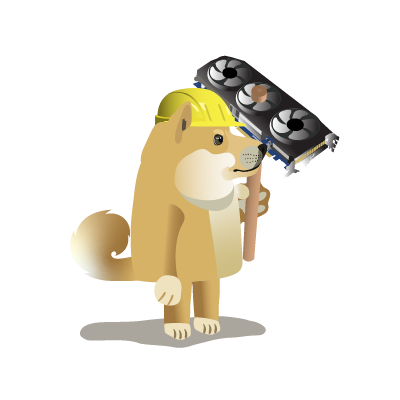

# Doge Arcade Game




## Introduction
Welcome to Doge Arcade, an 2D platformer game infused with elements from the world of Dogecoin. This edition is a refined adaptation of the 'Journey to the Moon' proof of concept (POC), originally crafted for the Dogecoin Foundation Dogeathon 2022. While the POC was developed in Unity for a WebGL-based gaming experience, Doge Arcade elevates the gameplay with Python's versatile 'arcade' library. At its core, the game seamlessly integrates with the doge_data_hub API, fetching real-time Dogecoin-related data, thereby enriching the gaming experience with dynamic cryptocurrency insights. Join us on this unique and captivating journey, blending the excitement of gaming with the intriguing world of Dogecoin.

## Features
- **Dynamic Status Bar**: Displays real-time Dogecoin prices, lives, coins collected, and other important game stats.
- **More features coming soon**
## Installation

To run Doge Arcade, follow these steps:

1. **Clone the Repository**
   ```
   git clone https://github.com/hectorMiranda/the-doge-times
   ```
2. **Navigate to the Game Directory**
   ```
   cd doge_arcade
   ```
3. **Install Dependencies**
   - Ensure Python 3.11 and pip are installed on your system.
   - Install the required Python packages:
     ```
     pip install -r requirements.txt
     ```

## Running the Game

To start the game, run:

```
python3 doge_arcade.py
```

## Game Controls

- **Arrow Keys**: Move the character.
- **Spacebar**: Jump.
- **S**: Toggle music on/off.
- **Z**: increase character size
- **X**: reduce character size

The game has also been tested using a PS4 wireless controller.

## doge_data_hub API 

The game leverages the doge_data_hub API to get dogecoin related data.

## Contributions

Contributions to Doge Arcade are welcome. Please stay tuned to learn about the process for submitting pull requests to us.

## Other relevant information

../artwork/sprites//PlayerIdle.png
../artwork/sprites/PlayerRun.png

sprite: 128 x 126 pixels

## Open Source Acknowledgements

This project includes code from the following open source project:

- [community-platformer](https://github.com/pythonarcade/community-platformer)
  - Original License: MIT
  - Some portions of this code has been incorporated into this project, which is licensed under the GPL-2.0.

The GPL-2.0 License text for our project can be found in the [LICENSE](https://github.com/hectorMiranda/the-doge-times/blob/main/LICENSE) file. The original MIT License notice is retained in the respective [MIT_LICENSE](https://github.com/hectorMiranda/the-doge-times/blob/main/doge_arcade/MIT_LICENSE) file.
