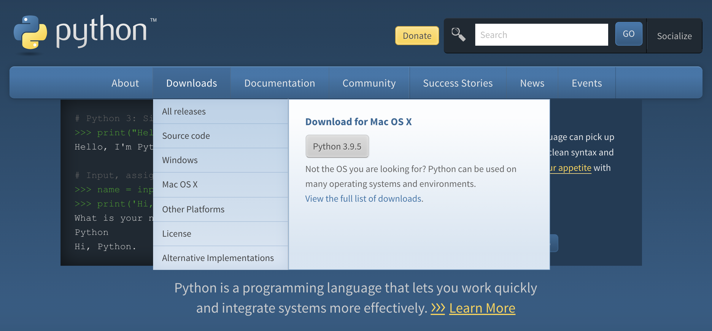

# Download Python

## Usages

- Automation
- Artificial Intelligence

## Installation

To install the latest version of Python refer to https://www.python.org, look for the downloads menu and select the recommended option.



In this particular case, I'm using Python 3.9.5, at this point you can open a [Terminal](../the-terminal/the-terminal.md) window and type the command:

```shell
python3.9
```
